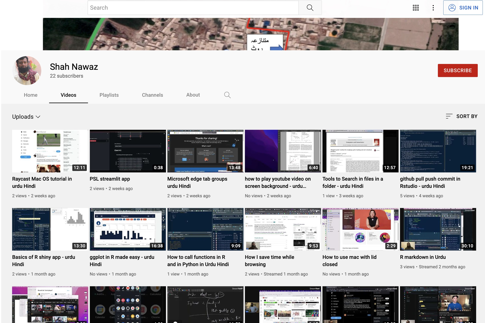

- 👋 Hi, I’m @shahnawaz323
- 👀 I’m interested in Data Science
- 🌱 I’m currently learning Python and Machine learning
- 💞️ I’m looking to collaborate on Data Science in Geomechanics
- 📫 How to reach me shah.nawaz@univ-grenoble-alpes.fr

<!---
shahnawaz323/shahnawaz323 is a ✨ special ✨ repository because its `README.md` (this file) appears on your GitHub profile.
You can click the Preview link to take a look at your changes.
--->

    

        
    

    

        <h2>🤝 Connect with me</h2>
         
        <dl>
        <dt>
         
        </dt>
        <dt>
            
        </dt>
        <dt>
            
        </dt>
        <dt>
        
        </dt>
        </dl>
        <h2>💼 Work & Affiliations</h2>
        <dl>
        <dt>PhD Student</dt>
        <dd>
            <a href="https://3sr.univ-grenoble-alpes.fr/">Laboratoire 3SR</a>
        </dd>
        </dl>
    

